# Ad Campaign Dashboard

Flutter mobile app for monitoring ad campaign performance — campaigns, spend summary, real-time anomaly alerts, and profile settings. Supports light and dark mode.

## How to run

**Requirements:** Flutter SDK (stable)

```bash
flutter pub get
flutter run
```

**Run tests:**

```bash
flutter test
```

## Screenshots

### Campaign List

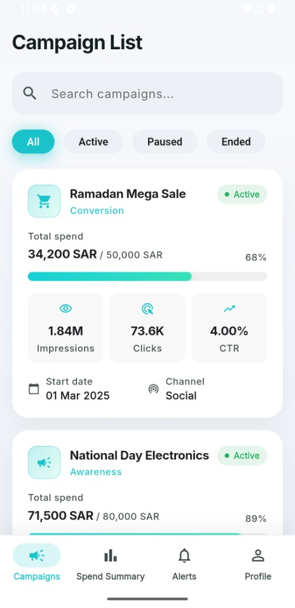
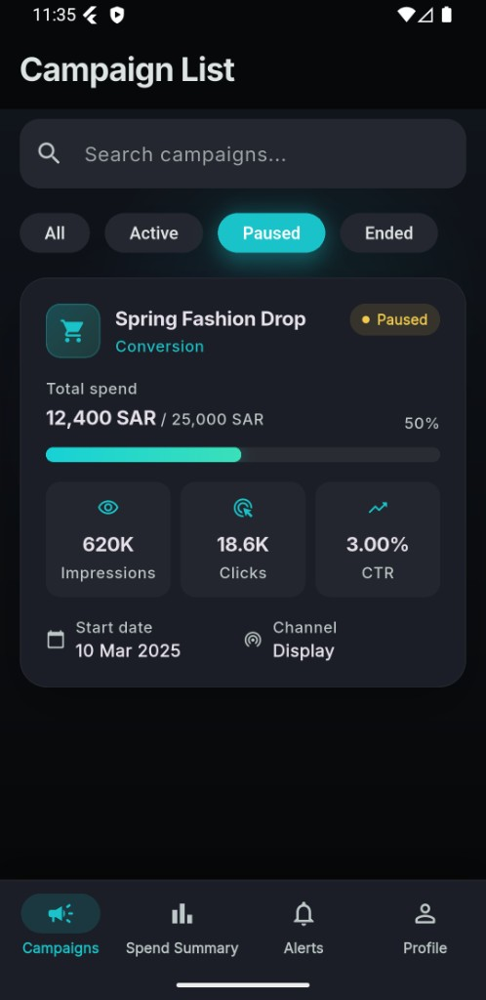
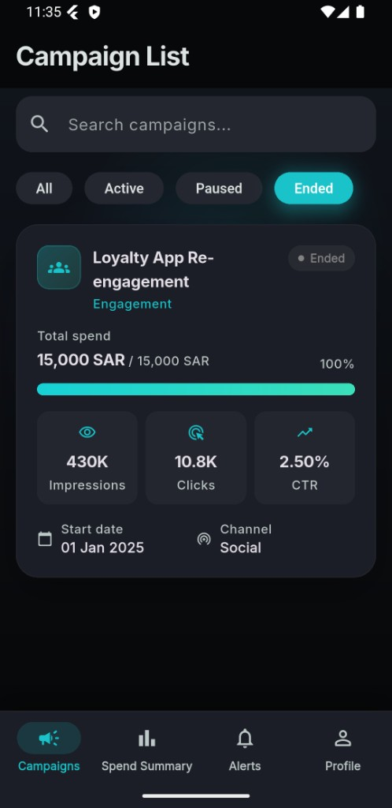

### Campaign Detail

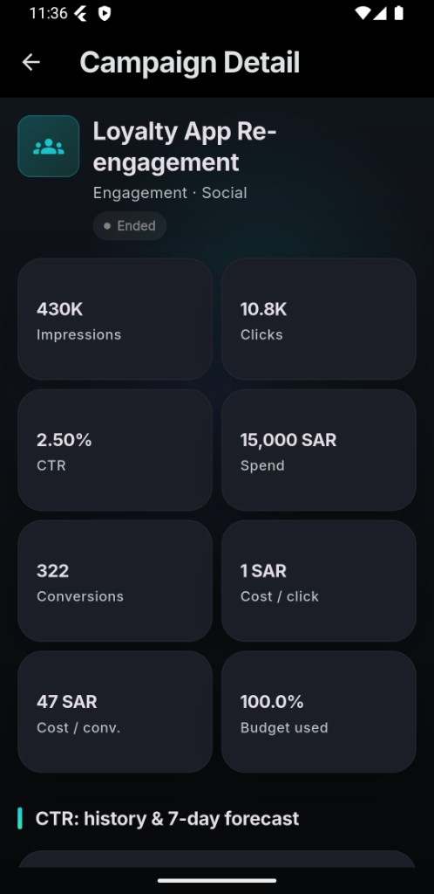
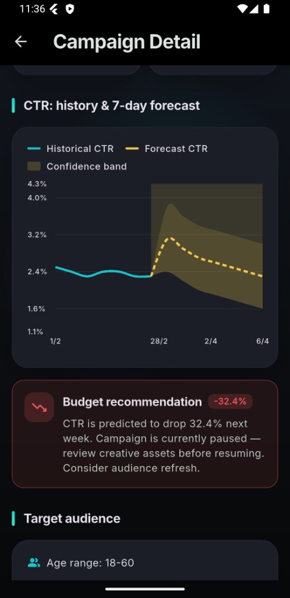
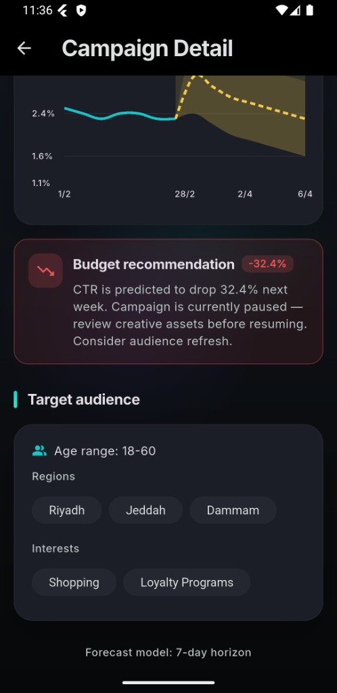

### Spend Summary

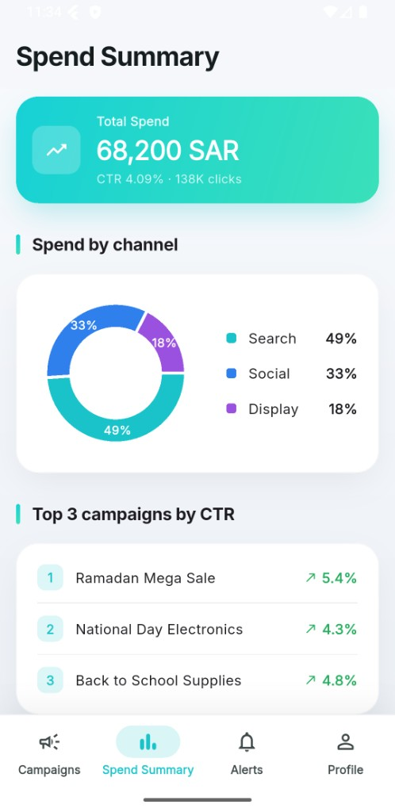
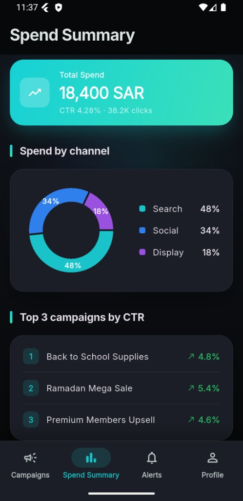

### Alerts

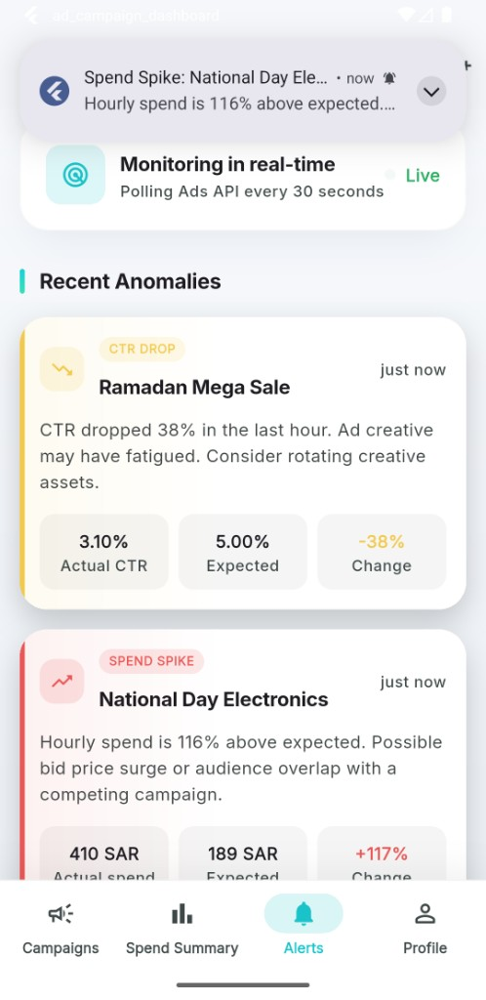
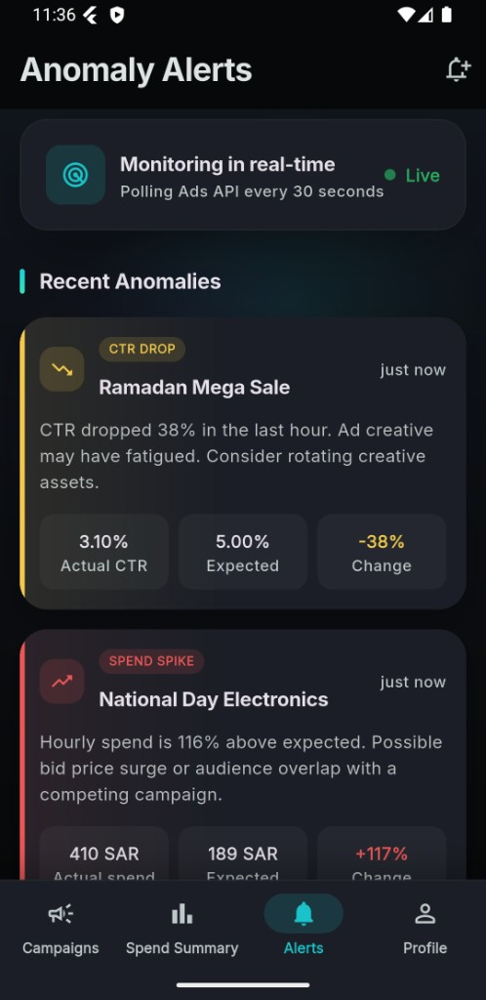

### Profile

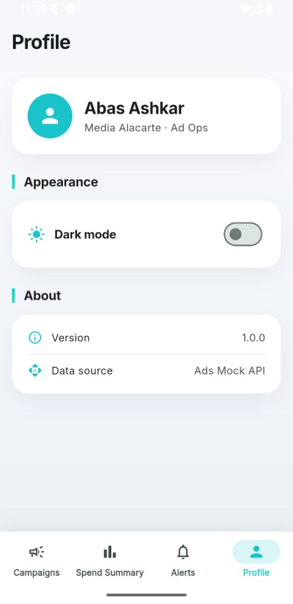
